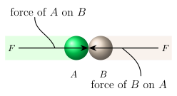

# Fundamental Concepts

## Basic Quantities

### Length
Length is used to define a position in space and the dize of the physical system. 

### Time
Used to define a succession of events. Statics is inherintly time independant. 

### Mass
Used to measure the quantity of matter that is used to compare one body to that of another. 

### Force
The "push" or "pull" exerted by on body on another. 

## Idealizations
Models or idealizations are used to simplify application of the theory. 

### Particle
A partiacle has a mass, but a physical size that can be neglected. This is often called a point-mass. Often where the physical size is insignificant compared to the overall physical scale. Example being the size of Earth compared to its distance to the sun. 

### Rigid Body
The assumption where a body cannot be deformed, and perfectly transfers force across itself. 

### Concentrated Force
Represents the effect of a load acting at a point on a body. Doable when the area where the load applied is small compared to the overall size of a body.

## Newton's Laws of Motion

### First law
Inertia, a particle does not change state unless subjected to an _unbalanced_ force.

### Second Law
A particle affected by an unbalanced force $\bold F$ experiances acceleration in the same direction as the applied force; with magnitude relative to mass. 

$$\bold F = m\bold a$$

### Third Law
For every action there is a reaction. If body $\bold a$ exerts a force on body $\bold b$. $\bold b$ exerts an equal but opposite force on body $\bold a$.

### Gravitational Attraction

$$F = G\frac{m_1m_2}{r^2}$$

where\

&emsp; F = force of gravity \
&emsp; G = universal gravitation constant. G = 66.73($10^{-12}$) $m^3 / (kg * s^2)$ \
&emsp; m = mass of particle \
&emsp; r = distance between the particles

### Weight
Weight is the force felt by on a mass by gravity. 

$$\fbox{W=mg}$$
