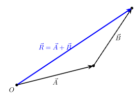
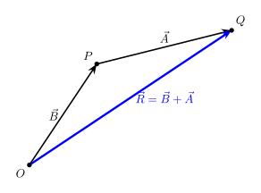

# Vector Operations
## Multiplication and Division of a vector by a scalar.
If a vector is multiplied/divided by a scalar, its magnitude is changed by that much. Example Vector = 25MPH north, divided by the scalar=25MPH, equal a Vector with 1MPH north. If the scalar is negative, the direction of the Vector is flipped. In our example if we divided by Scalar=-25MPH, we would have a vector with 1MPH south. 

## Vector Addition.
When adding vectors together it is important to remember their magnitudes and their directions. To do this we must use the **triangle law of addition**. To illustrate, the two ***component vectors*** $\vec{\mathbf{A}}$ and $\vec{\mathbf{B}}$ are added to form the resultant vector $\vec{\mathbf{R}}$. Note that it does not matter the order you add them in.
- At an arbitrary point define O. The origin in this case.
- Draw the first vector, A
- At the head of A, draw B.
- You now arrive at the point Q, which defines the Resultant vector R. 

## Vector Subtraction
What is subtraction but adding a negative. The resultant is the difference between the two vectors. Its easier to think about this as

$$\vec{\mathbf{R}} = \vec{\mathbf{A}} - \vec{\mathbf{B}} = \vec{\mathbf{A}} + (-\vec{\mathbf{B}})$$

## Example
Given vector $\vec{\mathbf{A}}$ = [3,4] and vector $\vec{\mathbf{B}}$ = [5,6]:
- Find the resultant vector $\vec{\mathbf{R}}$
- The magnitude of $\vec{\mathbf{R}}$
- and the unit direction of $\vec{\mathbf{R}}$

#### Resultant Vector
$$\vec{\mathbf{R}} = \vec{\mathbf{A}} + \vec{\mathbf{B}} = [3,4] + [5,6] = [3+5, 4+6] = [8,10]$$

#### Magnitude

$\lvert{}\vec{\mathbf{R}}\rvert{} = \sqrt{R^2_x + R^2_y}$

$\lvert{}\vec{\mathbf{R}}\rvert{} = \sqrt{8a^2 + 10^2} \approx{} 12.81$

#### Unit Direction 

$\hat{\mathbf{R}} = \frac{\vec{\mathbf{R}}}{\lvert{}\vec{\mathbf{R}}\rvert{}}$

$\hat{\mathbf{R}} = \frac{[8,10]}{12.81} \approx [0.625, 0.781]$

## More Info
The next chapter (2.3) is filled with examples on methods and techniques on how to do this. In addition to adding multiple (>2) vectors. 

