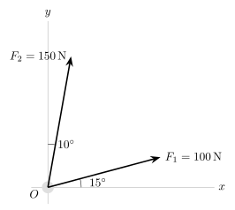
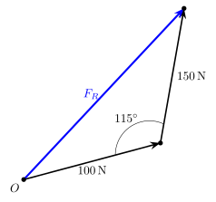
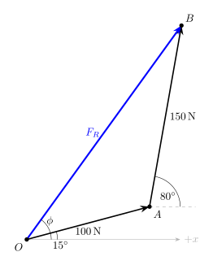

# Vector Additon of Forces
We know from physics that force is a vector quantity since it has a magnitude and a direction. Two common provlmes in statics are releated to finding resultant forces, knowing its components, resolving a known force into two components. 

## Finding Resultant forces
The triangle rule is arguably the best way of visualizing a resultant force, its a set of directions instead of a list of ingrediants. The book likes to say the law of cosines and law of sins is the best way of converting vectors into a resultant vector. While this is efficent for two known vectors, if the number of vectors exceeds that amount the math gets longer and more annoying. 

## Addition of Several forces
More often than not more than two forces are acting on a object. A car for example, the engine is powering the wheels, provinding a forward force on the vehicle, the wind is providing a backwards force on the vehicle, slowing it down. The car has weight and is exerting a force on the road, therefor the road is exerting a force on the vehicle. The triangle rule is supreme as we can simply add these force vectors ontop of eachother to figure out our resultant force. The forces can simply be known as 
    
$$F_R = (F_1 + F_2) + F_3$$

## How I solve force problems.
- Apply the triangle rule, drawing the vectors head-to-tail, drawing their angle with respect to the common axis.
- Writed down all of the force vectors we know, in order, with respect to a common axis. I usually use the positive x-axis as the reference axis since it is easy and commonplace. 
    - $F_1 = 150\text{N} \ @ \ 15\degree{}$
    - $F_2 = 120\text{N} \ @ \ 85\degree{}$
    - Etc
- Breakdown these vectors into a matrix vector [x,y]
    - $x = a * \cos{\theta}$
    - $y = a * \sin{\theta}$
    - Where is the magnitude of the vector, for the given example $a$ = 150N, $\theta$ = $15\degree{}$
- Sum these vectors, which gives the resultant vector in matrix form.

---

## Example using rule of cosines vs matrix form

Given the force diagram above, determine the magnitude and direction of the resultant force.

---

### Law of Cosines Solution
Step 1.

 Draw the vectors head-tot-tail. First drawing the 100N, then the 150N. Order doesnt matter but for the example that is the order I'll be picking. Finally drawing the resultant for $F_R$ from the origin to the final point. 

Step 2.
 You **cannot** use the given angles directly. The angle between the two vectors orginally is 
 
 $(90-10)-15 = 65\degree{}$

 When drawing the triangle head-to-tail, the interior angle becomes 
 
 $180\degree -65\degree = 115\degree$

 The 180 comes from the sum on interior angles of a triangle.

 
 
 
Step 3:  Apply law of cosines

 $F_R = \sqrt{A^2 + B^2-2AB\cos{C}}$
 
 Where

 - $A=100N$
 - $B=150N$
 - $C=115\degree$

 Substitute into equation

 $F_R = \sqrt{100^2 + 150^2-2(100)(150)\cos{115\degree{}}}$

 $F_R=213\text{N}$

Step 4: Apply law of sines

 $\frac{\sin{\theta}}{150} = \frac{115\degree{}}{213}$

 Solve

 $\theta{} = 39.8\degree{}$

Step 5: Convert to requested angle
 
 The problem wants the angle measured from the horizonal, since the first force is $15\degree$ above the horizontal we must add the two angles.

 $\phi = 15\degree + 39.8\degree = 54.8\degree$

 ---

### Matrix Vector Composite
Dont let the name fool you, this is industry standard and works with the same exact process every time regardless of the number of vectors involved. We use a vector notation for the forces, splitting them into components in the form:

$\vec{F} = [F_x,F_y]$

Step 1: Resolve Forces into X and Y components

$F_{1x} = 100\cos{15\degree}$

$F_{1y} = 100\sin{15\degree}$

$\vec{F_1} = [96.59,25.88]\ \text{N}$

Since this is in reference to the positive x-axis, we most convert the $10\degree$ relative to the y-axis, to be in reference to the x-axis.

$90\degree - 10\degree = 80\degree$

Now resolve Force 2

$F_{2x} = 150\cos{80\degree}$

$F_{2y} = 150\sin{80\degree}$

$\vec{F_2} = [26.05,147.72]\ \text{N}$

Step 2. Addition

$\vec R = \vec F_1 + \vec F_2$

$R_x = 96.56+26.05 = 122.64\ \text{N}$

$R_y = 25.88+147.72 = 173.60\ \text{N}$

$\vec R = [122.64, 173.60]\ \text{N}$

Step 3. Magnitude

$\lvert{}\vec{R}\rvert{} = \sqrt{R^2_x + R^2_y}$

$\lvert{}\vec{R}\rvert{} = \sqrt{122.64^2 + 173.60^2} \approx 213\ \text{N}$

Step 4. Direction

Use the tangent

$\tan{\phi} = \frac{R_y}{R_x}$

$\tan{\phi} = \frac{173.60}{122.64}$

$\phi = \tan^{-1}{\frac{173.60}{122.64}}\approx 54.8\degree$
