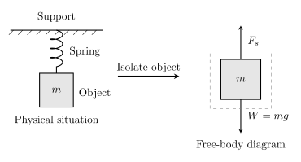
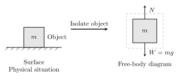

# The Free Body Diagram

Before applying the equilibrium equations, we must isolate the particle and draw all external forces acting on it. This is standard practise for all engineering, statics, and dynamics problems. 

## Typical Forces
In statics there are a handfull of force types we will deal with, they all have their own rules and applications but over all are quite simple.

### Weight
Anything that has mass will typically have weight. So long as it is affected by gravity. Now weight is a force typically denoted as $W$. Its calculation is simple as $W=mg$ where m is the objects mass and g is the gravity, typically 9.81 m/s/s

### Tension
Cables/Ropes can only support a tension or "pulling" force, which always acts in the direction of the cable, not perpindicular for example. 

### Normal Force
If an object rests on a smooth surface, then the surface will exert a **normal force** ${N}$ on the object. *Typically* this force will be equal to $W$ with the opposite direction, assuming the object as at rest and no other force is acting on it.

### Springs
Springs are just a rope that doesn't like to be moved. A linear and elastic spring will have a **undeformed length** $l_0$ If the length of spring is changed to be **length** $l$, it will generate a force equal its **spring constant** $k$ times this change in length $s = (l-l_0)$. It should be noted that springs work in both tension (pulling) and compression (pushing).

$$
\boxed{F=ks}
$$
---
## Example
### Example 1
Below is an example of an object hanging from a ceiling, affected by its own weight and the spring
{: style="width:100%; max-width:800px;" }
We can tell from the example that:

$$
F_s=mg
$$
Since the object is at rest and there are no other forces acting on the object.

### Example 2
Below is an example of an objet sitting on a smooth surface.

{: style="width:100%; max-width:800px;" }
We can tell from the example that

$$
N=mg
$$
Since the object is at rest on the table, without other forces acting upon it.

---
## Conclusion
A free body diagram (FBD) is created by isolating the object of interest and showing only the external forces acting on it. The forces are represented as arrows with their direction and relative magnitude.

You can think of a free body diagram as a "force portrait" of the object:

- isolate the object,
- remove all surrounding structure,
- draw each external force as an arrow,
- label each force clearly.

