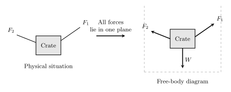

# Coplanar Forces
If an object is under a system of forces that share on the same plane, for example the x-y plane, each force can be resolved into its axial components. In cartesian format this would be its **i** and **j** components. For this system of forces to be in equalibrium, each component must sum to zero. 

$$\sum \mathbf{F} = 0$$

$$\sum{}F_x\mathbf{i}+\sum{}F_y\mathbf{k} = 0$$

For this equation to be true, each component in the resultant force must be equal to zero. Therefor:

$$
\boxed{\sum{}F_x=0\quad{}\sum{}F_y=0}
$$

## Example
{: style="width:100%; max-width:800px;" }

It can be assumed that:
$$
\vec{\mathbf{F_r}} = \vec{\mathbf{F_1}}+\vec{\mathbf{F_2}}+\vec{\mathbf{W}} = 0
$$
