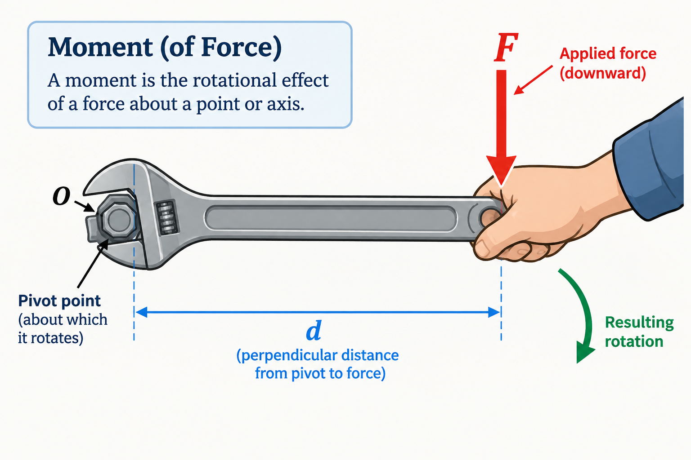

# Moment of a Force
When a force is applied to an object not directly on its center of mass, it will typically cause the body to rotate about a point that is not in line with the vector of the force. This tendancy to rotate is commonly refered as torque, but in physics it is called the **moment**. 
{: style="width:75%; max-width:800px; display:block; margin: 0 auto" }

The magnitude of this moment is proportional to the force (F) and the *perpendicular* distance of the moment arm (d). 

## Magnitude
{: style="width:75%; max-width:400px; display:block; margin: 0 auto" }

$$\boxed{M_O = Fd}$$

## Non-perpindicular Magnitude
If the force is acting in parallel to the moment arm, thinking pushing or pulling the wrench, then the moment is 0 since $\sin0\degree=0$. Note the placement and definition of $\theta$.
{: style="width:75%; max-width:400px; display:block; margin: 0 auto" }

$$M_O=F_\perp{}d=F\sin{\theta\degree}d$$

## Direction

The direction of $\mathbf{M_O}$ is defined by the moment axis, which is perpendicular the plane that contains the Force and the moment arm d. This moment follows the right hand rule for rotation. That sounds really complicated, in laymans terms if the Force and moment arm exist in the x-y plane, the moment is along the z-axis. Well what about the right hand rule? If you make a thumbs-up with your right hand, and uncurl your fingers a little bit, you have created the premise of the rule. The thumb defines the axis (z-axis in this case), and the curl of the fingers defines the positive direction, counter-clockwise in this case. 

## Resultant moments
Similar to forces multiple moments may act on an object so long as the Forces all lie in the same two-dimensional plane.  using the right hand rule and the moment equation, this moments can be added (or subtracted) accordingly to find the resultant moment. If a moment is counter-clockwise it will be considered positive, if it is clockwise then it will be considered negative so long as they all act on the same axis.  

$$
\mathbf{M_R} =\mathbf{M_1} + \mathbf{M_2} + \mathbf{M_3}
$$

$$
\mathbf{M_R} = F_1d_1 + F_2d_2 + F_3d_3
$$